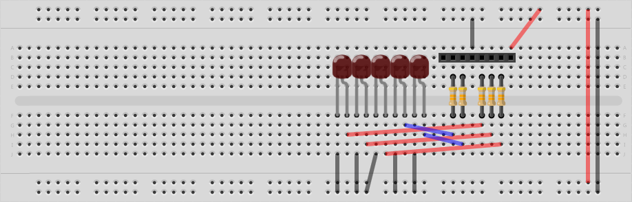
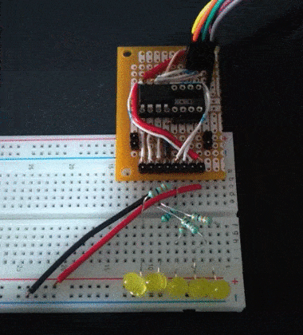
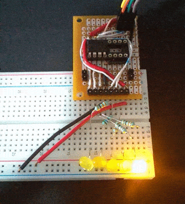
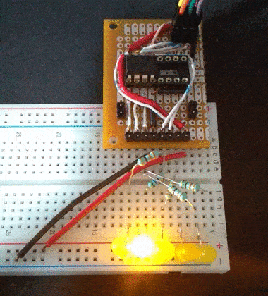

# Blinking LEDs

A set of blinking LEDs examples using a basic circuit in order to getting familiar with the I/O pins of the ATtiny 85 as outputs.

## Breadboard.

Use this circuit to run the examples:



## How to run the example codes.

Open a terminal/console and go to the path where the C code is stored. Then run the following commands (don't forget to change the _single_blink.c_ filename depending on the project you want to test):

  ```bash
  # Compile the C code.
  avr-gcc -mmcu=attiny85 -Os single_blink.c

  # Copy data and text segments from a.out and create a new a.hex (ihex type).
  avr-objcopy -O ihex -j .text -j .data a.out a.hex

  # Upload the a.hex binary to the microcontroller using an usbasp programmer.
  avrdude -p t85 -c usbasp -U flash:w:a.hex:i
  ```

## Examples.

* [01 Single blink](../../Projects/Blinking_LEDs/01_Single_blink/single_blink.c)



* [02 Blink loop](../../Projects/Blinking_LEDs/02_Blink_loop/blink_loop.c)



* [03 Blink knight rider](../../Projects/Blinking_LEDs/03_Blink_knight_rider/blink_knight_rider.c)

