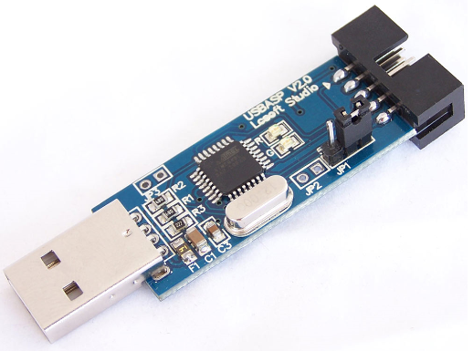
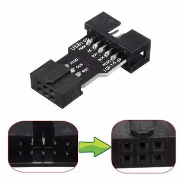
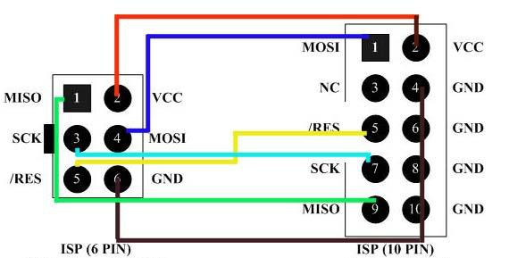
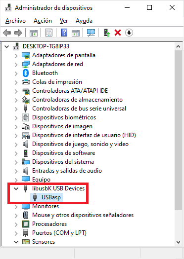

# ATtiny 85

## What this repo is about?

Code examples using the Atmel ATtiny 85 AVR 8-bits microcontroller programmed using avr-gcc compiler and USB Asp programmer.

## Contents.

* [Getting started.](#getting-started)
  * [1. Making our development board.](#1-making-our-development-board)
  * [2. Getting an AVR programmer.](#2-getting-an-avr-programmer)
  * [3. Installing the programmer's driver.](#3-installing-the-programmers-driver)
  * [4. Installing the compiler.](#4-installing-the-compiler)
  * [5. Flashing our first program.](#5-flashing-our-first-program)
* [Projects in this repo.](#projects-in-this-repo)
* [Hardware used.](#hardware-used)

## Getting started.

### 1. Making our development board.

There are some commercial development boards for the ATTiny 85, nevertheless is not a big deal to make your own board. This process can be faster than waiting for the delivery of one bought online and even more if you already have the required components:

* 1 prototype PCB board.
* 1 microcontroller socket (8 pin preferably, but any other bigger also works).
* Single and double row male PCB connectors.
* Wires.
* Soldering station.

I'm not going further with the process of soldering this board, but the result must be close to this one:


### 2. Getting an AVR programmer.

There are a lot of AVR programmers that are compatible with the avrdude utility to flash your AVR microcontroller. The examples are flashed using an USB Asp programmer like the one in the image below.



The connector provided by this programmer is a Ten Pin ICSP connector, in the market is very easy to get one 10-to-6 pin adapter like this one:



... another option is to use Dupont cables and follow the next diagram without using any adapter:



### 3. Installing the programmer's driver.

For the USB Asp programmer, the drivers can be found at [fischl's website](https://www.fischl.de/usbasp/). Look for the one you need based on your Operating System.

> For Windows 10, the one that works for me is the one listed as "libusbK (v3.0.7.0)".
> 

### 4. Installing the compiler.

For these examples we are using the avr-gcc compiler. The official site of this compiler is [nongnu.org/avr-libc](https://www.nongnu.org/avr-libc/) and here you will be pointed to [sourceforge.net/projects/winavr/](https://sourceforge.net/projects/winavr/) to download the installer (if you are using Windows).

> Don't forget adding the location of the binaries and tools to your System Variables.
> In my case they are "C:\WinAVR-20100110\bin" and "C:\WinAVR-20100110\utils\bin". They can look different depending on your setup preferences.

### 5. Flashing our first program.

Now is time to flash the "hello world!" of the microcontrollers, the single blinking LED example.

Go to [this path](Projects/Blinking_LEDs), replicate the prototype in your breadboard, plug the programmer to your computer, open a console and do:

  ```bash
  # Compile the C code.
  avr-gcc -mmcu=attiny85 -Os single_blink.c

  # Copy data and text segments from a.out and create a new a.hex (ihex type).
  avr-objcopy -O ihex -j .text -j .data a.out a.hex

  # Upload the a.hex binary to the microcontroller using an usbasp programmer.
  avrdude -p t85 -c usbasp -U flash:w:a.hex:i
  ```

  The output in your console must be similar to this:

  ```bash
  C:\Workspaces\github\ATtiny85\Projects\Blinking_LEDs\01 Single blink>avr-gcc -mmcu=attiny85 -Os single_blink.c
  In file included from single_blink.c:4:
  c:/winavr-20100110/lib/gcc/../../avr/include/util/delay.h:85:3: warning: #warning "F_CPU not defined for <util/delay.h>"

  C:\Workspaces\github\ATtiny85\Projects\Blinking_LEDs\01 Single blink>avr-objcopy -O ihex -j .text -j .data a.out a.hex

  C:\Workspaces\github\ATtiny85\Projects\Blinking_LEDs\01 Single blink>avrdude -p t85 -c usbasp -U flash:w:a.hex:i

  avrdude: warning: cannot set sck period. please check for usbasp firmware update.
  avrdude: AVR device initialized and ready to accept instructions

  Reading | ################################################## | 100% 0.01s

  avrdude: Device signature = 0x1e930b
  avrdude: NOTE: FLASH memory has been specified, an erase cycle will be performed
           To disable this feature, specify the -D option.
  avrdude: erasing chip
  avrdude: warning: cannot set sck period. please check for usbasp firmware update.
  avrdude: reading input file "a.hex"
  avrdude: writing flash (88 bytes):

  Writing | ################################################## | 100% 0.12s

  avrdude: 88 bytes of flash written
  avrdude: verifying flash memory against a.hex:
  avrdude: load data flash data from input file a.hex:
  avrdude: input file a.hex contains 88 bytes
  avrdude: reading on-chip flash data:

  Reading | ################################################## | 100% 0.05s

  avrdude: verifying ...
  avrdude: 88 bytes of flash verified

  avrdude: safemode: Fuses OK

  avrdude done.  Thank you.
  ```

  ## Projects in this repo.

  * [Blinking LEDs](Projects/Blinking_LEDs): A set of blinking LEDs examples using a basic circuit in order to getting familiar with the I/O pins of the ATtiny 85 as outputs.

  ## Hardware used.

  * Atmel AVER ATtyni 85 microcontroller.
  * [PDF datasheet](/Misc/ATtiny_85_Datasheet.pdf)
  
  _Credits: SpenceKonde's github._